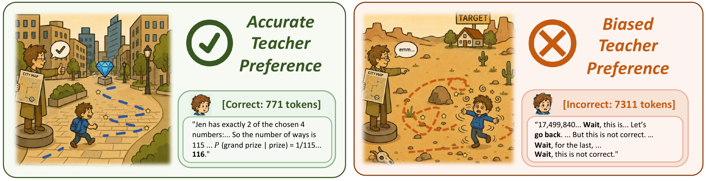

<h1 align="center">
  Gains and Collapse in On-Policy Distillation:<br>
  A Reinforcement Learning Perspective
</h1>

<!-- Replace the two href placeholders with the website and paper URLs. -->
<p align="center">
  <a href="https://hanccui.github.io/opd_hacking">🌐 Website</a> &nbsp; | &nbsp; <a href="#">📄 Paper</a>
</p>

<p align="center">
  Han Cui<sup>1,2,*</sup>, Jianhao Yan<sup>2,*</sup>, Yun Luo<sup>2,*</sup>,
  Hongbo Zhang<sup>1,2</sup>, Zhizhang Fu<sup>2</sup>, Yue Zhang<sup>2,†</sup>
</p>
<p align="center">
  <sup>1</sup> Zhejiang University &nbsp; <sup>2</sup> Westlake University<br>
  <sup>*</sup> Equal contribution. &nbsp; <sup>†</sup> Corresponding author.
</p>

On-policy distillation (OPD) amplifies student behaviors through the teacher's implicit reward signal.
In our experiments, reliable teacher feedback makes correct responses easier to sample without expanding the observed set of solvable problems;
misaligned feedback instead reinforces excessively long, repetitive responses—even when the teacher rarely generates such text itself.
Masking unhealthy responses and using SFT initialization mitigate this collapse, highlighting that successful OPD depends on how reliably the teacher evaluates student rollouts, beyond the quality of its own generations.

<p align="center">
  
</p>
<!-- <p align="center"><em>OPD amplifies what the student already samples.</em></p> -->

---

## 📚 Overview

- 📖 [Introduction](#introduction)
- ✨ [Installation](#installation)
- 🗂️ [Data & Models](#data--models)
- 🔧 [Training](#training)
- 🌻 [Acknowledgements](#acknowledgements)
- 🎈 [Citation](#citation)

---

## Introduction

This repository provides the training code and experiment configurations for our
study of gains and collapse in on-policy distillation.

```text
opd_hacking/
├── slime/              # Core training and rollout implementation
├── scripts/            # Experiment recipes (001–013), installation, and OPD hooks
│   └── launchers/      # Shared training launchers
├── patches/            # Project patches applied during installation
├── figures/            # README figures
└── docs/               # Reserved for additional documentation
```

<!-- Add the paper link when ready. -->

## Installation

With Conda, the CUDA 12.9 toolkit (`nvcc`), Git, and a C++ compiler available,
create the `opd` environment and install dependencies from `opd_hacking/`:

```bash
conda create -n opd python=3.12 pip -y
conda activate opd
bash scripts/install_dependencies.sh
```

Activate `opd` again in each new terminal before running training.

This fetches pinned slime/SGLang/Megatron sources, applies two upstream and three
project patches, and installs PyTorch 2.9.1, backend dependencies, and this project
in editable mode. Dependencies are listed in `requirements*.txt`; source versions
and patch steps are maintained in [the installer](scripts/install_dependencies.sh).

Run once with a fresh `../slime` directory. For another location, export
`SLIME_UPSTREAM_DIR` before installation and training; optional `MEGATRON_PATH`
and `SGLANG_PATH` overrides must also point to fresh locations (`SGLANG_PATH`
ends in `sglang/python`). Relative paths are resolved from this project root.

## Data & Models

Before downloading models or datasets, set their local storage directories. Run from
`opd_hacking/` and keep these variables exported when launching training:

```bash
export MODEL_ROOT=./models  # Download student and teacher checkpoints here.
export DATA_ROOT=./data     # Download and prepare training/evaluation datasets here.
mkdir -p "$MODEL_ROOT" "$DATA_ROOT"
```

Change these values to your storage locations. Relative paths are resolved from this
project root; absolute paths are also supported. The installer does not download
models or datasets. Place checkpoints and prepared data under these roots using the
[required model directories](scripts/CONFIGURATIONS.md#required-model-directories)
and [data layout](scripts/CONFIGURATIONS.md#required-data-files).

<!-- Add verified model/data download links and preparation instructions. -->

## Training

With the environment active and models/data prepared, inspect a configuration:

```bash
bash scripts/run-007-openthoughts-qwen3-4b-qwen3-1.7b-base-teacher-temp1.0-lr1e-6-len8k.sh --dry-run
```

Then start training:

```bash
bash scripts/run-007-openthoughts-qwen3-4b-qwen3-1.7b-base-teacher-temp1.0-lr1e-6-len8k.sh
```

See [experiment configurations](scripts/CONFIGURATIONS.md#paper-to-recipe-mapping)
for all 13 recipes. Training outputs are saved under `outputs/` by default.

## Acknowledgements

We thank the Qwen, DeepSeek, DeepScaleR, and JustRL teams for releasing the models used in our experiments.
Our implementation builds on [slime](https://github.com/THUDM/slime), with
[SGLang](https://github.com/sgl-project/sglang) for inference and
[Megatron-LM](https://github.com/NVIDIA/Megatron-LM) for training.
We use math answer-checking utilities adapted from DeepScaleR and thank the
DeepMath and OpenThoughts teams for their open datasets, as well as the broader
open-source community for making this research possible.

## Citation

```bibtex
% Add the arXiv BibTeX citation here.
```
